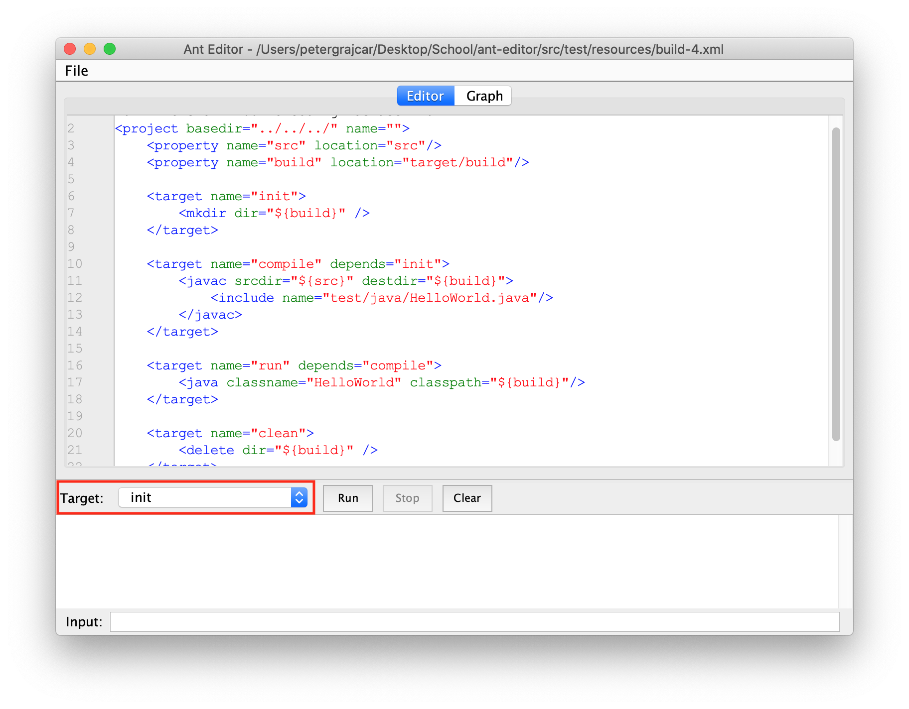
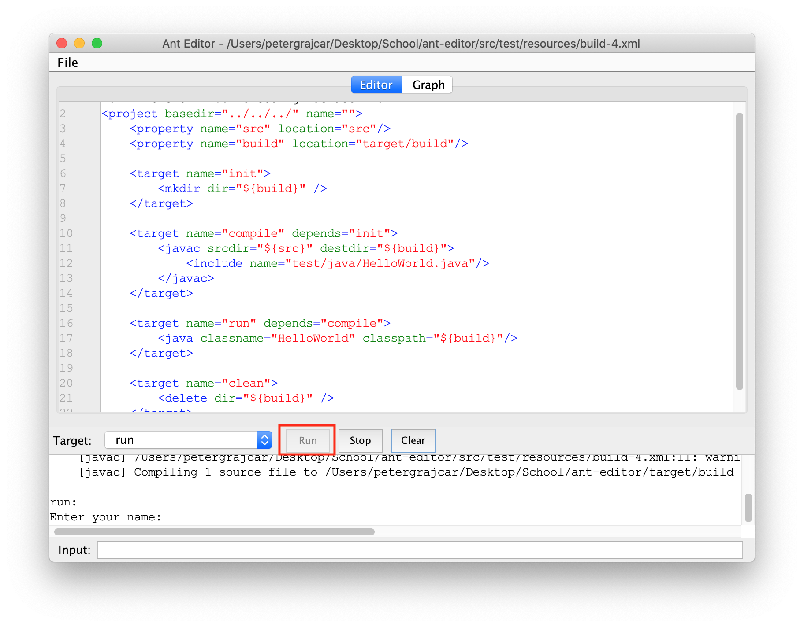
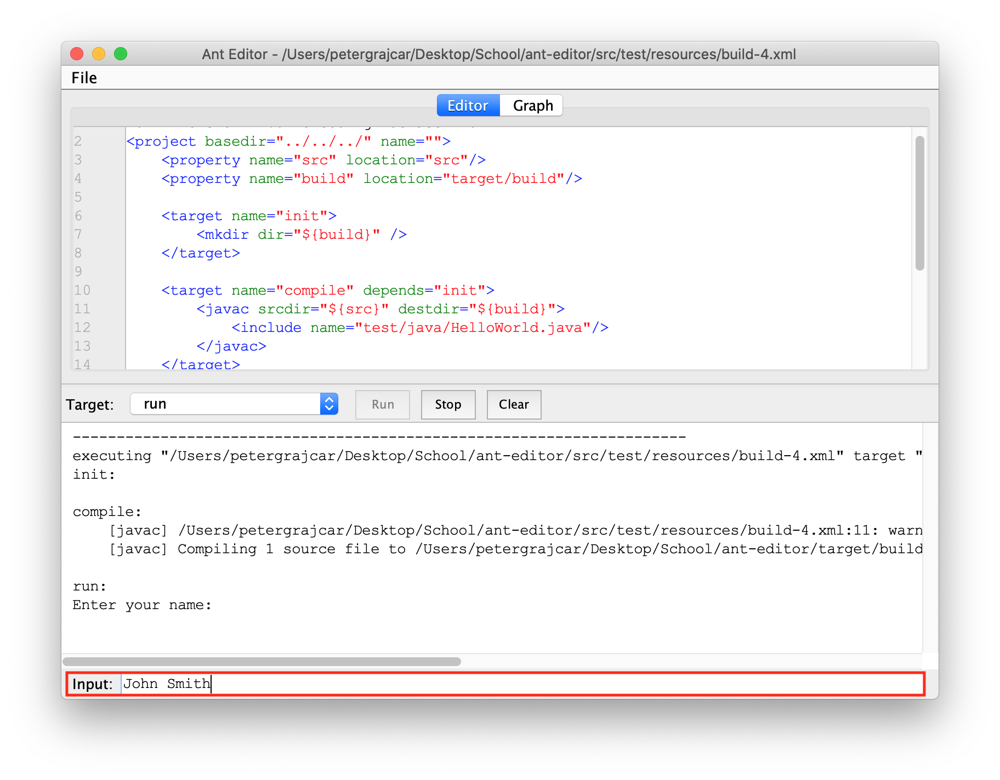
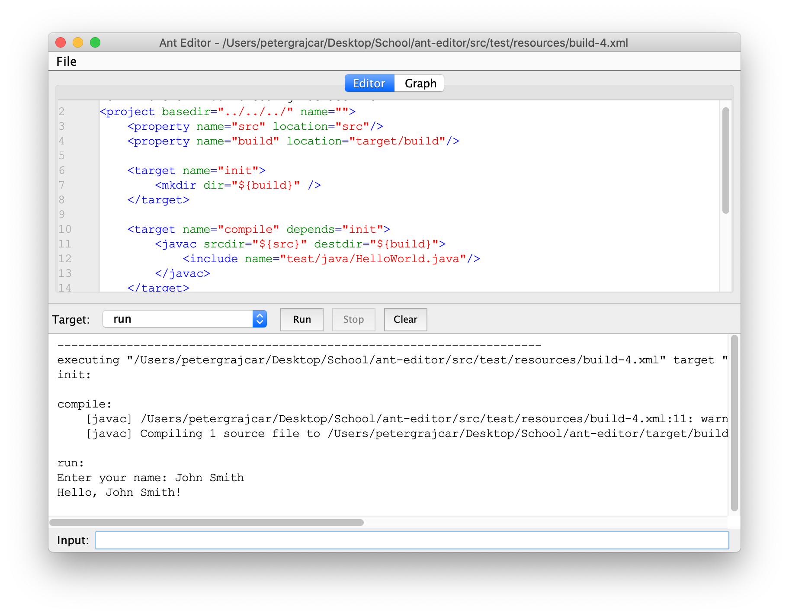
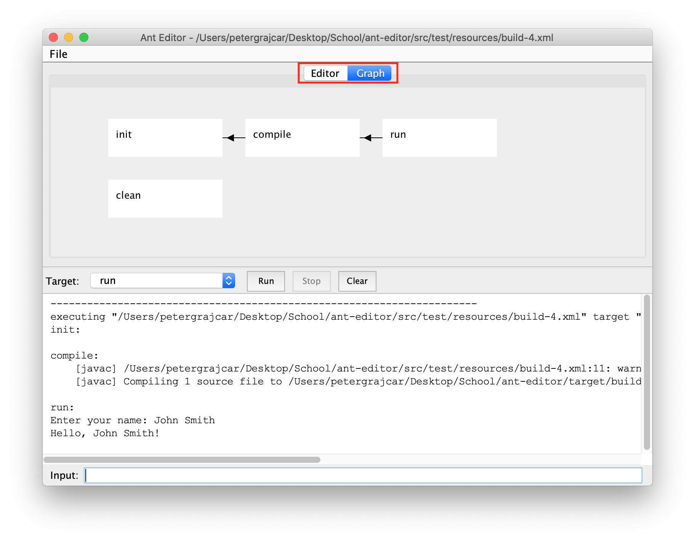

# Ant Editor

## Build

The project can be build using Maven. `mvn package` will create an executable
jar file.

Javadoc documentation can be generated with `mvn javadoc:javadoc` command.

## Documentation

<a target="_blank" href="http://www.ms.mff.cuni.cz/~grajcarp/ant-editor/apidocs">link to javadoc documentation</a>

## User Manual

You can open the file by pressing `Ctrl+O` or by selecting `File > Open` in
the menu.

When the file is opened you can choose an Ant target to run.

After the target is selected you can press run button to execute the 
target. Note that the target is executed from the saved file, so in order
to see changes made in the editor you must save the file first.

You can write to the standard input via the input field at the bottom of 
the window.

 

After hitting enter the input will be submitted.

You can switch between code editor view and target dependency graph using
the tabs at the top of the window. You can move the graph by dragging with
the mouse.

## Example

Example used  in previous section can be found in `src/test` directory. 
It contains Ant build script `build.xml` and a simple java program.